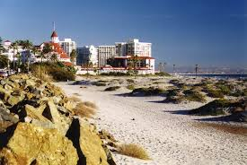
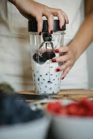
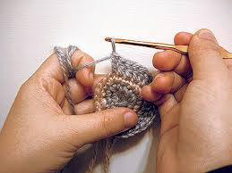

# My Summer In Markdown

## Introduction

My name is Caitlyn and I am a sophomore. I am taking four AP classes this year and plan to take four or five AP tests in May. In my free time, I like to do art such as crocheting and painting. I find these activities both fun and stress-relieving.

## Summer Activities

Before the school year ended, I signed up for four summer courses. 

Almost as soon as the school year ended, I started **Chicano**, **Psychology**, and **College Trigonometry**, each at different colleges in Southern California. I also decided to take a **Spanish 2** course on Edgenuity. 

Although finishing the courses felt highly rewarding, I highly recommend taking 1-3 summer courses instead of 4-5 because each class takes a large amount of time and committment, and unless one is motivated and goal-oriented producing quality work continuously for six weeks can be very *draining* and *exhausting*. 

## Summer Travel Experiences

Due to my multiple summer courses, I was short on free time. However, towards the end of July, my family and I were able to travel to San Diego to visit family. We stayed for one week and visited a second time two weeks later. On our second trip, my family stayed at a beachside hotel in Coronado and celebrated the end of our summer. 

## Favorite Summer Food

Two of my favorit desserts are cookies and ice cream. When my cousin visited, we made this dessert often. However, we usually made cookies and cream shakes by blending: 

- ice
- vanilla ice cream
- cookies
- milk

## Fun Fact About Myself

In my free time, I love to do different types of art. My favorite type of art is crochet. I make plushies, clothes, and other items. 

